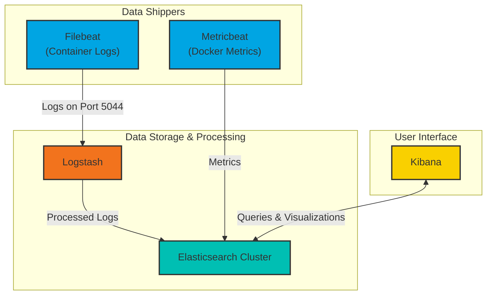

# ELK and EFK Docker Compose Stacks

This repository provides Docker Compose configurations for deploying ELK (Elasticsearch, Logstash, Kibana) and EFK (Elasticsearch, Fluentd, Kibana) stacks. These stacks are designed for robust log collection, analysis, and visualization.

**Author:** Mehrdad Koolaji

## Directory Structure

*   `elk/`: Contains the Docker Compose and configuration files for the ELK stack.
*   `efk/`: Contains the Docker Compose and configuration files for the EFK stack.
*   `.gitignore`: Specifies intentionally untracked files to ignore.
*   `en-elk.tar`: (If present) A tar archive potentially containing Docker images for the ELK stack.

## Common Setup and Prerequisites

Before deploying either stack, ensure you have the following installed:

*   **Docker**: Containerization platform.
*   **Docker Compose**: Tool for defining and running multi-container Docker applications.

### System Configuration

Elasticsearch requires a specific system setting for `vm.max_map_count`. This is handled automatically by the `start.sh` scripts in both `elk` and `efk` directories, but it's good to be aware of it.

```bash
sudo sysctl -w vm.max_map_count=262144
```

### Environment Variables (`.env`)

Both stacks rely on an `.env` file (located in their respective directories, e.g., `elk/.env`) to configure sensitive information and stack versions. A typical `.env` file might look like this:

```
STACK_VERSION=9.2.0
ELASTIC_PASSWORD=your_elastic_password
KIBANA_PASSWORD=your_kibana_password
CLUSTER_NAME=docker-cluster
KIBANA_PORT=5601
ENCRYPTION_KEY=a_very_long_random_string_for_kibana_encryption
KB_MEM_LIMIT=2g
LICENSE=basic
```

**Important:** Replace placeholder values with strong, unique passwords and a sufficiently long encryption key.

### Certificate Generation

Both `docker-compose.yaml` files include a `setup` service responsible for generating SSL/TLS certificates for Elasticsearch and Kibana, ensuring secure communication within the stack. This service runs once and creates the necessary certificates in the `./data/certs` directory.

## ELK Stack

The ELK stack is located in the `elk` directory and includes the following services:

*   **Elasticsearch (es01, es02, es03)**: Three-node Elasticsearch cluster for high availability and data storage. Configured with SSL/TLS and X-Pack security.
*   **Kibana**: The visualization layer, accessible via the configured `KIBANA_PORT` (default `5601`).
*   **Logstash**: Ingests data from Filebeat, processes it, and forwards it to Elasticsearch.
*   **Filebeat**: Collects container logs and forwards them to Logstash.
*   **Metricbeat**: Collects system and Docker container metrics and sends them directly to Elasticsearch.

### Data Flow (ELK)



1.  **Filebeat**: Configured via `filebeat/filebeat.yml` to monitor Docker container logs (`/var/lib/docker/containers/*/*.log`). It enriches logs with Docker metadata and forwards them to Logstash on port `5044`.
2.  **Metricbeat**: Configured via `metricbeat/metricbeat.yml` to collect Docker container metrics (CPU, memory, disk I/O, network, etc.) every 10 seconds. It sends these metrics directly to Elasticsearch.
3.  **Logstash**: Listens on port `5044` for Beats input (from Filebeat) as defined in `logstash/pipeline/02-beats-input.conf`. It then outputs the processed logs to Elasticsearch, creating daily indices like `filebeat-YYYY.MM.dd`.
4.  **Elasticsearch**: Stores and indexes all log and metric data received from Logstash and Metricbeat.
5.  **Kibana**: Connects to Elasticsearch to provide a user interface for searching, analyzing, and visualizing the collected data.

### Usage (ELK)

1.  Navigate to the `elk` directory:
    ```bash
    cd elk
    ```
2.  Create and configure your `.env` file (refer to the Environment Variables section).
3.  Run the `start.sh` script to set up system configurations, generate certificates, and start the services:
    ```bash
    bash start.sh
    ```
4.  Access Kibana: Once all services are up and healthy, you can access Kibana in your web browser at `https://localhost:5601` (or your configured `KIBANA_PORT`). You will need to log in with the `elastic` user and the `ELASTIC_PASSWORD` from your `.env` file.

To stop the ELK stack:

```bash
docker-compose down
```

## EFK Stack

The EFK stack is located in the `efk` directory and includes the following services:

*   **Elasticsearch (es01, es02, es03)**: Three-node Elasticsearch cluster, similar to the ELK stack, for data storage.
*   **Kibana**: The visualization layer.
*   **Fluentd**: The primary data collector, built from `efk/fluentd/Dockerfile` using `efk/fluentd/fluent.conf`.
*   **td-agent**: A stable distribution of Fluentd (`fluent/fluentd:v1.14-1` image), acting as a log forwarder to the main Fluentd service. Configured via `efk/td-agent.conf`.

### Data Flow (EFK)

```mermaid
graph TD;
    subgraph User Interface;
        Kibana;
    end

    subgraph Data Storage & Processing;
        Elasticsearch_Cluster[Elasticsearch Cluster];
        Fluentd;
    end

    subgraph Data Shippers;
        td_agent[td-agent <br> (Log Forwarder)];
    end

    td_agent -->|Logs on Port 24224| Fluentd;
    Fluentd -->|Processed Logs| Elasticsearch_Cluster;
    Kibana <-->|Queries & Visualizations| Elasticsearch_Cluster;

    style Kibana fill:#F9D000,stroke:#333,stroke-width:2px;
    style Elasticsearch_Cluster fill:#00BFB3,stroke:#333,stroke-width:2px;
    style Fluentd fill:#4A90E2,stroke:#333,stroke-width:2px;
    style td_agent fill:#B8E986,stroke:#333,stroke-width:2px;
```

1.  **td-agent**: Listens for incoming logs on port `24225` (mapped from container port `24224`). It then forwards these logs to the `fluentd` service within the Docker network.
2.  **Fluentd**: Listens for forwarded logs on port `24224` and can also receive logs via HTTP on port `9880`. It processes these logs and sends them to Elasticsearch, where they are indexed under the `fluentd-logs` index pattern.
3.  **Elasticsearch**: Stores and indexes all log data received from Fluentd.
4.  **Kibana**: Connects to Elasticsearch to provide a user interface for searching, analyzing, and visualizing the collected data.

### Usage (EFK)

1.  Navigate to the `efk` directory:
    ```bash
    cd efk
    ```
2.  Create and configure your `.env` file (refer to the Environment Variables section).
3.  Run the `start.sh` script to set up system configurations, generate certificates, and start the services:
    ```bash
    bash start.sh
    ```
4.  Access Kibana: Similar to the ELK stack, access Kibana at `https://localhost:5601` (or your configured `KIBANA_PORT`) and log in with the `elastic` user and `ELASTIC_PASSWORD`.

To stop the EFK stack:

```bash
docker-compose down
```

## License

This project is licensed under the MIT License.